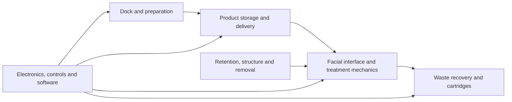

# Reading the engineering evidence

[Project overview](../README.md) · [Documentation index](README.md)

Masck One is pre-commercialisation. Engineering geometry exists and digital checks and validation frameworks exist, but product-level physical validation has not begun. This guide helps distinguish implemented digital evidence from planned validation and evidence that has not yet been obtained.

For a first review, the quickest route is the [project README](../README.md), which states the current stage, the digital development work, what remains unproven and what should be validated next. This document is for reviewers who want to inspect the evidence more deeply.

## Visual evidence at a glance

The diagram below is a reviewer-facing summary assembled from the repository's existing [Core Sketch product story](CORE_SKETCH_ONE_PAGE.md) and subsystem documentation. It shows the intended whole-product relationships at a high level. It is a documentation diagram, not evidence that every subsystem is implemented or physically validated.

The two views below are existing registered digital review compositions already committed to the repository. They are useful for understanding candidate packaging and exterior direction, but they are not photographs and are not released-main CAD evidence.

  
  

| View | What a reviewer can inspect | Evidence limit |
| --- | --- | --- |
| Front three-quarter | Candidate face-side packaging, opening layout and the overall relationship between the facial shell and surrounding structure. | Concept/candidate digital composition only. It does not prove released-main geometry, anatomical fit, comfort, sealing, treatment coverage or physical performance. |
| Side-rear | Candidate depth, rear packaging and the visible relationship between the face-side body and retention structure from a second viewpoint. | Concept/candidate digital composition only. It does not prove attachment closure, removal behaviour, serviceability, structural strength, manufacturability or safety. |

**Visual class:** concept/candidate digital composition. The [render manifest](../website/images/masck-inspection-v17c-manifest.json) records the source checkpoints, authority coordinate frame and explicit claim boundary for these views. Together, the two views show a coherent candidate packaging direction and reviewable multi-view geometry. They do **not** establish released-main geometry, frame-side attachment closure, human fit, comfort, materials, serviceability, ingress protection, manufacturability, safety or physical performance.

The repository does not currently commit a standalone gallery of engineering CAD screenshots. The stronger engineering evidence is therefore the source-bound parametric geometry, requirements, tests and reproducible exports described below, rather than treating presentation imagery as proof.

## Development progression

This is a compact progression based on repository milestones rather than a presentation graphic. Each step links to the underlying record a reviewer can inspect.

### Verifiable repository chronology

The dates below are Git commit dates. They show when inspectable work entered the repository, not when physical product capability was proven.

| Date | Inspectable milestone | What it demonstrates |
| --- | --- | --- |
| 30 August 2026 | [Authority-contract implementation](https://github.com/mlngaxri/MasckOne/commit/910d4fd1a03164e032847e590331cd7cddf51d8d) followed by the [facial-reference landmark contract](https://github.com/mlngaxri/MasckOne/commit/9c427d5faec3687c1a1422c6bea3edd9394bffb3) | The project moved beyond an idea into controlled requirements, automated checks, reproducible engineering structure and the first semantic facial-reference layer. |
| 10 September 2026 | [Whole-product Core Sketch convergence](https://github.com/mlngaxri/MasckOne/commit/0044a55885000480a873b5761742341038b24b6a) and [authority reconciliation](https://github.com/mlngaxri/MasckOne/commit/0c0ccb1d1b3356ed0001e5e53f318973a2893e08) | Work expanded from individual digital subsystems to explicit cross-subsystem conflicts, proof gates, mass/resource constraints and unresolved integration questions. |
| 14 September 2026 | [Public scholarship-review baseline](https://github.com/mlngaxri/MasckOne/commit/b4a105ea4483a6285be7d55fd527baea30ce6412) | Existing engineering work was reorganised for external review with clearer evidence boundaries, reviewer navigation and separation between digital work, planned validation and claims not yet supported. |

The chronology is deliberately short. It demonstrates founder initiative through inspectable outputs and version history, while avoiding the implication that rapid digital development equals rapid physical validation.

| Milestone | Inspectable record | What changed |
| --- | --- | --- |
| Controlled engineering foundation | [Phase 1 engineering log](PHASE_1_LOG.md) and [engineering governance](ENGINEERING_GOVERNANCE.md) | Repository integrity, machine-readable authority, reproducible CAD generation, source controls and continuous integration were established before deeper geometry work. |
| Digital subsystem build-out | [Development roadmap](DEVELOPMENT_ROADMAP.md) and [current authority](../config/masck_one_authority.yaml) | The merged digital baseline expanded across facial/interface geometry, fluid handling, waste, structural and actuation references, controls and reproducible exports. |
| Whole-product convergence | [Core Sketch convergence review](CORE_SKETCH_CONVERGENCE_REVIEW.md) and [status board](CORE_SKETCH_STATUS_BOARD.md) | Cross-subsystem conflicts, unknowns and validation gates were made explicit instead of being treated as solved by digital modelling. |
| Scholarship-review baseline | [Project overview](../README.md) and this evidence guide | The existing engineering record was reorganised into a short public inspection path with concept imagery separated from engineering evidence and planned physical validation. |

This progression shows increasing engineering scope and evidence discipline. It does not show increasing physical product maturity: an integrated manufactured product has not yet been validated.

## A short inspection route

| Question | Evidence to inspect | What it does not establish |
| --- | --- | --- |
| What is the product trying to do? | [Product concept](PRODUCT_CONCEPT.md) and [convergence review](CORE_SKETCH_CONVERGENCE_REVIEW.md) | That every proposed capability exists or is feasible |
| What controls the merged engineering baseline? | [Engineering authority](../config/masck_one_authority.yaml), its [schema](../schemas/masck_one_authority.schema.json), and the [roadmap](DEVELOPMENT_ROADMAP.md) | Completion of the expanded whole-routine product |
| Can the digital work be reproduced? | [Source](../src/masck_one/), [tests](../tests/), [quickstart](ENGINEERING_QUICKSTART.md) and [CI runs](https://github.com/mlngaxri/MasckOne/actions/workflows/ci.yml) | Physical performance from a green software result |
| Where are integration assumptions challenged? | [Contact and occlusion matrix](CORE_SKETCH_CONTACT_OCCLUSION_MATRIX.md) and [routine resource envelope](CORE_SKETCH_ROUTINE_RESOURCE_ENVELOPE.md) | Measured values where inputs remain unknown |
| What physical proof is required next? | [Reduced-region proof package](CORE_SKETCH_REDUCED_REGION_PROOF_PACKAGE.md) and [status board](CORE_SKETCH_STATUS_BOARD.md) | A completed experiment merely because a protocol exists |

## Engineering discipline in one scan

This is the shortest path for a reviewer assessing whether the repository contains controlled engineering work rather than code volume alone.

| Discipline | Representative evidence | What a reviewer can verify |
| --- | --- | --- |
| Parametric engineering geometry | [Engineering source](../src/masck_one/) and [engineering quickstart](ENGINEERING_QUICKSTART.md) | Geometry is generated from inspectable source and can be reproduced digitally; this is not a physical prototype claim. |
| Controlled requirements and provenance | [Engineering authority](../config/masck_one_authority.yaml), [authority contract tests](../tests/test_authority_contract.py) and [boundary-release tests](../tests/test_boundary_release.py) | Requirements, units, duplicated constraints and source-bound evidence are checked, including guards against presenting digital geometry as physical validation. |
| Source binding and stale-evidence rejection | [Boundary-release tests](../tests/test_boundary_release.py) | Generated interface evidence records the registered source revision and mesh identity, rejects changed registered geometry even when the source asset identifier is unchanged, and requires the resulting source chain to remain labelled digital-only rather than anatomical or physical validation. |
| Documented trade-offs and unresolved contradictions | [Whole-product convergence review](CORE_SKETCH_CONVERGENCE_REVIEW.md) | The record does not only present a preferred concept. It documents conflicts such as coverage versus support, mass versus CG/torque, product preservation, waste/service burden and emergency release, and assigns them to engineering or validation work rather than declaring them solved. |
| Major subsystem coverage | [Product architecture summary](CORE_SKETCH_ONE_PAGE.md), [contact/occlusion matrix](CORE_SKETCH_CONTACT_OCCLUSION_MATRIX.md) and [routine resource envelope](CORE_SKETCH_ROUTINE_RESOURCE_ENVELOPE.md) | Face interface/treatment, fluids and waste, retention/removal, electronics/controls, dock/service and whole-product resource interactions are represented in the digital engineering record. Coverage in documentation does not mean each subsystem is physically qualified. |
| Explicit unknowns and validation gates | [Status board](CORE_SKETCH_STATUS_BOARD.md) and [reduced-region proof package](CORE_SKETCH_REDUCED_REGION_PROOF_PACKAGE.md) | Missing evidence remains blocked, validation-gated, reference-only or unknown instead of being silently converted into a pass. Planned proof work is distinguishable from completed evidence. |

### Representative subsystem source trail

These are deliberately representative entry points, not a claim that every subsystem is complete. They let a reviewer move from the architecture summary into concrete engineering source in one click.

| Subsystem area | Representative source | What is inspectable now | Boundary |
| --- | --- | --- | --- |
| Whole-product / face-side geometry | [Parametric model](../src/masck_one/model.py) and [model checks](../tests/test_model.py) | Code-generated geometry, controlled material/reference roles and deterministic digital checks. | Does not establish human fit, comfort, sealing, safety or performance. |
| Structure and integration reservations | [Structural frame](../src/masck_one/structural_frame.py) | Named datums and explicit reservations for actuation, fresh fluid, waste, retention, HMI/electronics and thermal systems, including unresolved geometry states. | Topology and reservation evidence is not structural-strength or manufacturing evidence. |
| Actuation architecture | [Actuator frames](../src/masck_one/actuator_frames.py) and [actuator-frame checks](../tests/test_actuator_frames.py) | Four controlled actuation zones and fail-closed architecture/source checks. | Does not establish actuator force, lifetime, acoustics, comfort or physical motion quality. |
| Waste handling | [Realized mixed-waste backbone](../src/masck_one/realized_waste_backbone.py) | Source-bound route stages and provisional world-coordinate digital routing with explicit validation-gated status. | Does not establish hydraulic performance, recovery, leakage, hygiene or service performance. |

The point of these examples is traceability: architecture statements lead to inspectable implementation, while the implementation itself records what remains unproven. Candidate pull requests may contain newer subsystem work, but they are not silently treated as merged evidence.

## Representative requirements and automated checks

These examples show the pattern used across fit/interface, fluids and waste, retention/release, actuation, electronics/controls and other subsystem work. They are representative, not a readiness score or a substitute for the full engineering record.

| Repository evidence | Plain-language meaning | Evidence class |
| --- | --- | --- |
| [Authority requirements](../config/masck_one_authority.yaml) define, among other items, minimum nostril opening geometry, quick-release time and wet/unpowered operation requirements, fluid volumes, cartridge capacity, mass limits and pitch-torque limits. Many values are explicitly marked `VALIDATION_GATED`. | The design has controlled numerical requirements and records which ones still need validation instead of treating every design value as proven. | Existing digital engineering evidence; physical validation still required where gated |
| [Authority contract tests](../tests/test_authority_contract.py) reject inconsistent units/statuses, drift in duplicated airway requirements, an under-capacity cartridge ledger, a frame outside the outer envelope, fluid-ledger mismatch and unsupported commercial-state changes. | Automated checks catch contradictions in the engineering source of truth rather than only checking that code runs. | Existing automated digital evidence |
| [Boundary-release tests](../tests/test_boundary_release.py) bind generated interface boundaries to registered source geometry and explicitly require the result to remain labelled digital-only, not anatomical or physical validation. | Provenance is checked, and the test itself prevents a geometry result from being misreported as human-fit evidence. | Existing digital engineering evidence only |
| [Reduced-region proof package](CORE_SKETCH_REDUCED_REGION_PROOF_PACKAGE.md) describes bounded physical proof work required for contact and fit. | A written protocol is a validation plan, not a completed experiment. | Planned validation |

For example, inspection of protected-region geometry can show that a generated part respects a defined digital exclusion volume. It cannot show that the device is comfortable, fits a population or remains safe when worn. Likewise, a fluid-route model can establish connectivity without measuring delivery, leakage or recovery.

## Evidence classes

`Existing digital engineering evidence` means inspectable repository artifacts such as parametric geometry, requirements, source binding, design-decision records and automated checks. `Planned validation` means a protocol, test fixture concept, evidence gate or measurement plan exists but the test has not yet produced qualifying product evidence. `Physical/commercial evidence not yet obtained` covers customer demand, comfort, hygiene and cleaning, real fluid behaviour, safety, manufacturing feasibility, unit economics and product-level physical performance.

A synthetic test, geometry screen, framework or green CI run stays in the first class unless qualifying measurements exist. It must not be promoted into the third class by wording alone.

## Main, candidate work and historical records

`main` is the merged baseline. [Open pull requests](https://github.com/mlngaxri/MasckOne/pulls) contain proposed changes and subsystem investigations. Some are drafts awaiting integration or evidence. Their number and test results are not measures of product readiness.

Examples of candidate work are [facial-interface contact and proof tooling, PR #157](https://github.com/mlngaxri/MasckOne/pull/157) and [adversarial fit and registration tooling, PR #158](https://github.com/mlngaxri/MasckOne/pull/158). Follow the live PR state to see whether a proposal has subsequently merged. Synthetic cases and off-face measurement plans in these workstreams do not establish human fit or product efficacy.

When assessing a result, match the recorded source commit and inputs to the run being cited. An older green run does not qualify a later change. A PR description or dated status board can lag the current branch; inspect its latest commit and checks before treating it as current. The repository's provenance checks and evidence records are retained for this reason.

Development documents sometimes use `cell`, `lane` or `owner` for a workstream and its responsible development process. These are coordination terms, not employee counts. `Core Sketch` names the whole-product concept series; `CS-` identifiers track its work items. Existing names and paths remain where they are used by contracts, links or historical evidence.

## Customer feedback

The [customer discovery notes](CUSTOMER_DISCOVERY.md) record a founder-reported informal survey and its limitations. Reported interest is distinct from independently inspectable research, purchasing behaviour and validated demand. The next research questions are plans, not completed interviews.

## What remains open

Customer demand, comfort, hygiene and cleaning, real fluid behaviour, safety, manufacturing feasibility, unit economics and product-level physical performance are not yet proven. Physical contact, coverage, carryover between products, liquid containment, material compatibility, thermal/electrical behaviour and reliable removal also require appropriate measurement and review. Manufacturing, supplier qualification and compliance require their own evidence. Product demand and a viable business model require customer and commercial learning.

`BLOCKED`, `VALIDATION_GATED`, `REFERENCE_ONLY` and unknown values are meaningful limits. A blocked plan may demonstrate that the software rejects an unsupported operation; it does not demonstrate that the operation has become physically possible. Planning deadlines and generated assets do not override those limits.