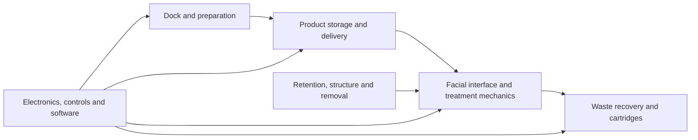

# Visual evidence index

[Project overview](../README.md) · [Evidence guide](EVIDENCE_GUIDE.md) · [Documentation index](README.md)

This page gives a scholarship reviewer the shortest visual inspection path through the existing repository. It does not add new engineering evidence. It only surfaces already committed artefacts and their evidence limits.

## How to read the visuals

| Evidence class | What it means here | What it does not mean |
| --- | --- | --- |
| Architecture diagram | A reviewer-friendly summary assembled from documented subsystem relationships. | Proof that every subsystem is implemented or physically validated. |
| Candidate digital composition | A registered visual composition derived from documented candidate geometry, with source checkpoints recorded in the render manifest. | Released-main CAD, a physical prototype, human fit, safety or performance evidence. |
| Source-bound engineering evidence | Repository source, authority records and automated checks that can be traced to specific digital engineering inputs and outputs. | Physical validation, manufacturing readiness or human-use readiness. |

These labels are deliberately conservative so presentation imagery is not mistaken for engineering proof.

## 1. Whole-product architecture

This diagram is assembled from the existing [Core Sketch product story](CORE_SKETCH_ONE_PAGE.md) and subsystem documentation. It shows documented subsystem relationships, not proof that every subsystem is implemented or physically validated.

## 2. Representative registered digital compositions

### Front three-quarter

**Evidence class:** candidate digital composition.

**What this helps inspect:** candidate face-side packaging, opening layout and the visible relationship between the facial shell and surrounding structure.

**Evidence limit:** it does not prove released-main geometry, anatomical fit, comfort, sealing, treatment coverage or physical performance.

[Open full-resolution view](../website/images/masck-inspection-front-3q-v17c.webp)

### Rear three-quarter

**Evidence class:** candidate digital composition.

**What this helps inspect:** candidate rear service-cover placement, occipital retention packaging and the relationship between the rear structure and the face-side body from a view not visible in the front composition.

**Evidence limit:** it does not prove the frame-side retention attachment, normal-release behaviour, fit, comfort, service access, structural performance or manufacturability.

[Open full-resolution view](../website/images/masck-inspection-rear-3q-v17c.webp)

### Side-rear

**Evidence class:** candidate digital composition.

**What this helps inspect:** candidate depth, rear packaging and the visible relationship between the face-side body and retention structure.

**Evidence limit:** it does not prove attachment closure, removal behaviour, serviceability, structural strength, manufacturability or safety.

[Open full-resolution view](../website/images/masck-inspection-side-rear-v17c.webp)

The [registered render manifest](../website/images/masck-inspection-v17c-manifest.json) records the asset version, camera definitions, coordinate frame, source checkpoints, image hashes and explicit claim boundary for these compositions. The manifest classifies the exterior and retention geometry as candidate work rather than released-main physical evidence.

### Provenance at a glance

| Registered field | Manifest record | What a reviewer should infer |
| --- | --- | --- |
| Asset version | `v17c` | All three views belong to one registered inspection set rather than unrelated presentation images. |
| Engineering authority revision | `2026-08-30-R1` | The composition is tied to a named digital authority revision. |
| Coordinate frame | `MASCK_ONE_AUTHORITY_WORLD_MM` | The contributing geometry is registered in the project authority coordinate frame. |
| Exterior geometry | Candidate renderer-pass checkpoint, not released-main geometry | The exterior is useful for inspecting candidate packaging direction, but must not be presented as the released engineering baseline. |
| Retention geometry | Current candidate solid geometry; attachment counterpart unresolved | The retention form is inspectable candidate work, but its complete attachment path is not proven by the render. |
| Physical validation | Not claimed by the manifest | The images do not establish fit, comfort, safety, serviceability, manufacturability or physical performance. |

This summary is transcribed from the registered manifest so a reviewer can understand the provenance without reading raw JSON. The manifest remains the source of record.

## 3. Development in three inspectable steps

These are repository milestones, not claims of physical product maturity. The dates are Git commit dates and each step links to the underlying record.

| Date | Repository milestone | What a reviewer can verify |
| --- | --- | --- |
| 30 August 2026 | [Controlled engineering authority](https://github.com/mlngaxri/MasckOne/commit/910d4fd1a03164e032847e590331cd7cddf51d8d) and [facial-reference contract](https://github.com/mlngaxri/MasckOne/commit/9c427d5faec3687c1a1422c6bea3edd9394bffb3) | The project had moved beyond an idea into controlled requirements, automated checks and an inspectable digital engineering structure. |
| 10 September 2026 | [Whole-product convergence](https://github.com/mlngaxri/MasckOne/commit/0044a55885000480a873b5761742341038b24b6a) | Individual digital workstreams were being considered together, with cross-subsystem conflicts and unresolved proof gates recorded rather than hidden. |
| 14 September 2026 | [Public scholarship-review baseline](https://github.com/mlngaxri/MasckOne/commit/b4a105ea4483a6285be7d55fd527baea30ce6412) | The existing engineering record was reorganised so an external reviewer can distinguish digital evidence, planned validation and unsupported claims. |

This progression demonstrates increasing scope and evidence discipline. It does not demonstrate increasing human-use readiness, physical validation or commercial readiness.

## 4. Engineering evidence behind the visuals

The repository does not currently contain a standalone gallery of released-main engineering CAD screenshots. The stronger engineering evidence is source-bound and reproducible rather than presentation imagery.

For a direct inspection path, open the [parametric engineering source](../src/masck_one/), the [engineering authority](../config/masck_one_authority.yaml), the [automated tests](../tests/) and the [engineering quickstart](ENGINEERING_QUICKSTART.md). These can demonstrate controlled digital geometry, provenance and automated checks. They do not establish human fit, comfort, safety, cleaning efficacy, manufacturability or physical product performance.

For the fuller explanation of evidence classes, development progression and validation boundaries, continue to the [evidence guide](EVIDENCE_GUIDE.md).
