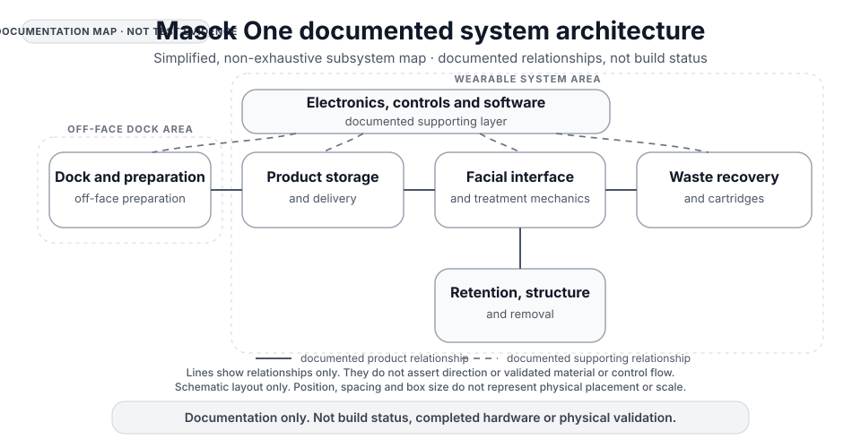
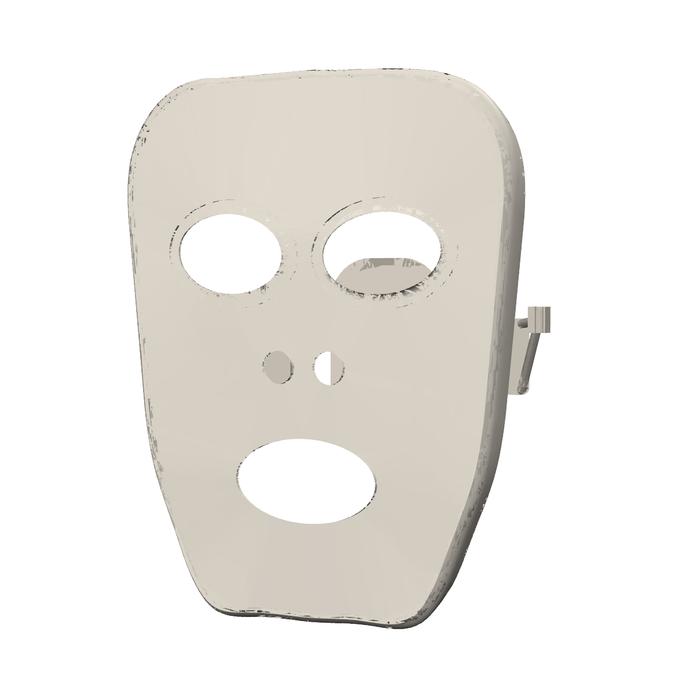
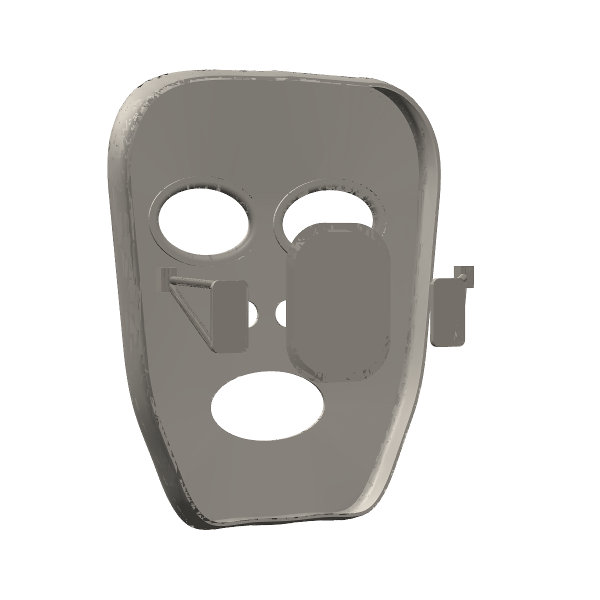
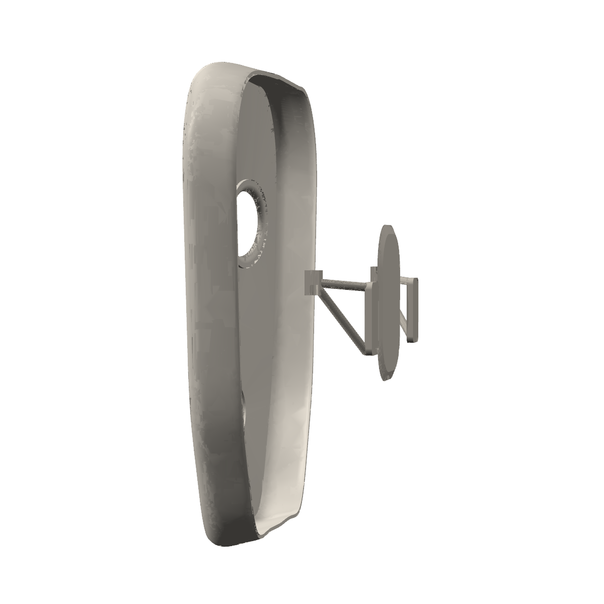

# Visual evidence quicklook

[Project overview](../README.md) · [Full visual evidence index](VISUAL_EVIDENCE_INDEX.md) · [Scholarship review snapshot](SCHOLARSHIP_REVIEW_SNAPSHOT.md)

This page is a deliberately short visual check for scholarship review. It surfaces existing repository artefacts only and does not add engineering evidence.

> **Reviewer takeaway:** the repository contains substantial, traceable digital engineering work. The architecture diagram explains the documented whole-product system, while the three registered compositions provide a concise visual inspection of candidate packaging and geometry direction. Neither should be read as evidence of a manufactured prototype, human fit, safety or physical performance.

**What a reviewer can verify here:** a documented whole-product architecture, traceable candidate digital geometry, controlled engineering sources and automated digital checks exist in the repository. **What a reviewer cannot verify here:** that Masck One has been manufactured, fitted to people, physically tested, proven safe, proven manufacturable or shown to meet product-level performance targets.

**Evidence hierarchy:** treat the source-bound model, controlled engineering authority and automated checks as the engineering record. Use the architecture diagram to understand that record at whole-product level, and the registered compositions to orient yourself visually. The compositions are supporting inspection aids, not stronger evidence than the underlying sources and checks.

### 30-second review path

1. [Open the architecture diagram](assets/scholarship-system-overview.svg) to understand how the documented product subsystems relate.
2. Scan the three registered candidate compositions below to see representative digital packaging and geometry direction.
3. Verify the underlying digital record directly in the [parametric model source](../src/masck_one/model.py), [controlled engineering authority](../config/masck_one_authority.yaml) and [automated tests](../tests/), then read the evidence boundary below before drawing conclusions about physical maturity.

This path deliberately separates visual orientation from engineering evidence: the diagram and compositions make the work legible, while the linked source, authority and checks are the inspectable digital record.

### How to read the visuals

| Label | Meaning |
| --- | --- |
| **Architecture diagram** | A simplified map of documented subsystem relationships. It explains the intended system structure, not implementation or validation status. |
| **Registered candidate digital composition** | A traceable view assembled from existing candidate digital sources. It supports inspection of digital packaging and geometry direction, but is not released engineering computer-aided design (CAD) or physical evidence. |
| **Concept imagery** | Brand or product-direction imagery. It is not engineering geometry or validation evidence and is excluded from the evidence views below. |

## 1. Whole-product architecture

**Visual status: DOCUMENTED ARCHITECTURE, NOT IMPLEMENTATION EVIDENCE**

[Open the architecture diagram at full size](assets/scholarship-system-overview.svg).

**What this shows:** a reviewer-friendly map of the documented whole-product architecture and the intended relationships between the major subsystems. It gives a non-technical reviewer one place to see the dock and preparation stage, product storage and delivery, facial interface and treatment mechanics, waste recovery, retention and removal, and the supporting electronics, controls and software layer.

**What it does not show:** implementation status, physical integration or validation of any subsystem. The diagram summarises existing documentation; it is not a prototype or test result.

**Traceability:** this diagram is a reviewer abstraction of subsystem relationships already documented in the [project overview](../README.md), [product concept](PRODUCT_CONCEPT.md) and [whole-product convergence review](CORE_SKETCH_CONVERGENCE_REVIEW.md). Those documents describe intent and integration context; the [engineering authority](../config/masck_one_authority.yaml) remains controlling for engineering truth.

## 2. Representative registered digital work

**Visual status: CANDIDATE DIGITAL COMPOSITIONS, NOT RELEASED CAD OR PHYSICAL EVIDENCE**

These three images are the strongest concise visual summary currently registered in the repository. They are **candidate digital compositions**, not standalone screenshots of released engineering CAD. Their value is that their contributing digital sources and evidence limits are recorded explicitly.

**Source status at a glance:** all three views use the same registered composition. The visible exterior comes from boundary-representation renderer-pass checkpoint `17e7db2`; retention comes from separate candidate checkpoint `2568676` in the same authority coordinate frame. The manifest records the camera definitions and image hashes for each view. They are shown together for inspection, but the repository does not claim that those sources form a released integrated CAD state.

**Why these views are shown:** the repository does not currently contain a concise, reviewer-ready gallery of released-main CAD screenshots. Using the registered compositions is more transparent than relabelling presentation imagery or candidate screenshots as released CAD. The source-bound engineering record linked below remains the stronger evidence of controlled digital work.

**Selection rationale:** these three views are retained because together they cover the face side, rear service and retention arrangement, and product depth without repeating near-identical angles. Website hero images are deliberately excluded because they are concept imagery rather than engineering evidence. This is a small evidence set chosen for inspectability, not a gallery of every visual artefact in the repository.

**What to look for:** use the front three-quarter view to inspect the face-side opening layout and overall packaging direction; use the rear three-quarter view to inspect the candidate rear service-cover and retention arrangement; use the side-rear view to inspect product depth and the relationship between the face-side body and rear structure. These are visual inspection cues only. They do not convert the compositions into released CAD or physical evidence.

| Front three-quarter | Rear three-quarter | Side-rear |
| --- | --- | --- |
|  |  |  |
| **Shows:** candidate face-side packaging and opening layout assembled from traceable digital sources. **Does not prove:** released engineering geometry, anatomical fit, comfort, sealing or treatment performance. **Traceability:** [registered manifest](../website/images/masck-inspection-v17c-manifest.json). | **Shows:** candidate rear packaging, service-cover placement and retention form assembled from traceable digital sources. **Does not prove:** retention attachment, release behaviour, fit, serviceability, structural performance or manufacturability. **Traceability:** [registered manifest](../website/images/masck-inspection-v17c-manifest.json). | **Shows:** candidate product depth and the visible relationship between the face-side body and retention structure. **Does not prove:** attachment closure, removal behaviour, structural strength, manufacturability or safety. **Traceability:** [registered manifest](../website/images/masck-inspection-v17c-manifest.json). |

**Important visible-geometry boundary:** the manifest records the dry-side package as a current candidate internal package that is **not rendered as visible exterior**, and the primary-control location as capacity-only with mapping and final hardware unresolved. Reviewers should therefore not infer internal electronics packaging or final control hardware from these exterior views.

**Evidence class:** registered candidate digital compositions. These are not photographs, released engineering CAD or physical-test evidence. They are included because their digital provenance is recorded, not because they establish product readiness.

**Engineering evidence behind the images:** the repository's stronger engineering proof is source-bound rather than photographic. The [parametric model source](../src/masck_one/model.py), [engineering authority](../config/masck_one_authority.yaml) and [automated tests](../tests/) show how geometry, requirements and digital checks are represented and controlled. They still do not establish physical fit, comfort, safety or performance.

**One-click provenance:** the visible exterior contribution traces to candidate renderer-pass checkpoint [`17e7db2`](https://github.com/mlngaxri/MasckOne/commit/17e7db204c693f684855d923fcacd7c95468e599), while the retention contribution traces to candidate checkpoint [`2568676`](https://github.com/mlngaxri/MasckOne/commit/25686766238b66ecf900009042d721c08e042592). These links establish where the contributing digital geometry came from; they do not make either checkpoint released-main CAD or physical evidence.

**How these images were assembled:** the registered manifest records a composite of existing candidate digital sources rather than one released whole-product CAD state. The exterior comes from the last checkpoint whose multi-view boundary-representation renderer passed; retention comes from a separate current candidate in the same authority coordinate frame. The primary-control location is capacity-only, and the dry-side internal package is not rendered as visible exterior geometry. This makes the views useful for inspecting candidate packaging relationships, but not evidence that those sources have been integrated, released or physically validated together.

The [registered render manifest](../website/images/masck-inspection-v17c-manifest.json) records the exact source checkpoints, camera definitions, coordinate frame, image hashes and explicit claim boundary.

## 3. Verifiable development progression

This is a short repository timeline, not a product-readiness timeline. Each milestone links to the underlying commit so a reviewer can inspect the record directly. The final row is included because evidence curation is itself visible in version history: obsolete presentation imagery was removed from the live README rather than left where it could be mistaken for current product evidence.

| Date | Inspectable milestone | Evidence boundary |
| --- | --- | --- |
| 30 August 2026 | [Controlled engineering authority and requirements structure](https://github.com/mlngaxri/MasckOne/commit/910d4fd1a03164e032847e590331cd7cddf51d8d) | Shows controlled digital requirements and checks, not physical validation. |
| 10 September 2026 | [Whole-product convergence record](https://github.com/mlngaxri/MasckOne/commit/0044a55885000480a873b5761742341038b24b6a) | Shows subsystem work being considered together with unresolved proof gates recorded, not a validated integrated prototype. |
| 14 September 2026 | [Public scholarship-review baseline](https://github.com/mlngaxri/MasckOne/commit/b4a105ea4483a6285be7d55fd527baea30ce6412) | Shows the existing evidence reorganised for external inspection, not an increase in physical or commercial maturity. |
| 16 September 2026 | [Obsolete concept renders removed from the live README](https://github.com/mlngaxri/MasckOne/commit/8d37bc322b5ebe42179685a1a0559f2fcb1b5f22) | Shows active evidence hygiene: superseded presentation imagery was removed from the primary reviewer path. It does not add engineering or physical evidence. |

## 4. Evidence boundary

The repository contains substantial inspectable digital engineering, including controlled requirements, code-generated parametric geometry, automated checks and recorded system-integration work. That is evidence of digital development and engineering discipline. It is not evidence of a physically validated product.

Website hero imagery is **concept imagery** and is intentionally excluded from this quicklook. It communicates product direction and brand intent, not engineering geometry or validation. For source provenance, additional development detail and the distinction between concept imagery, candidate compositions and source-bound engineering evidence, use the [full visual evidence index](VISUAL_EVIDENCE_INDEX.md).
